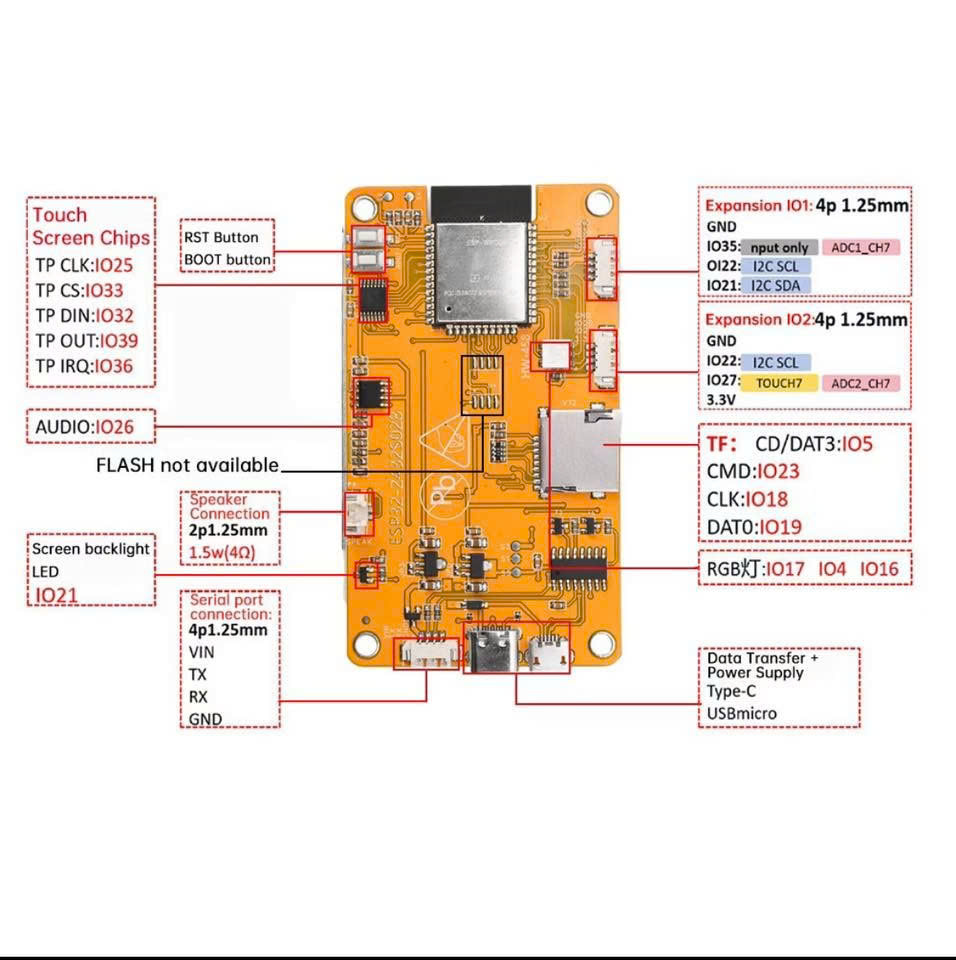
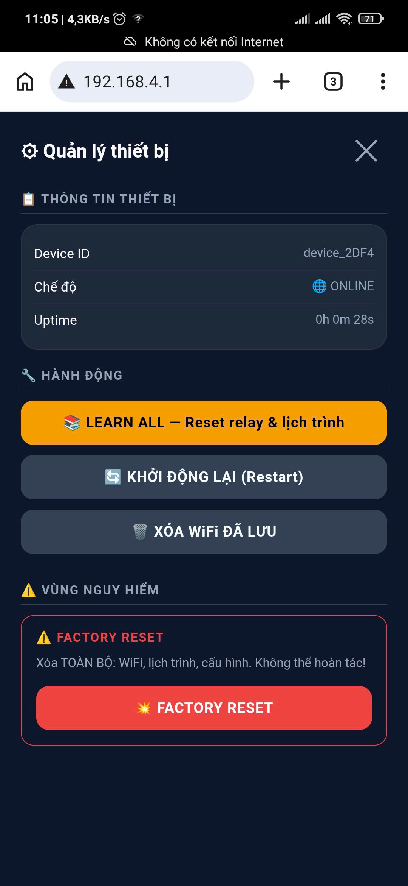
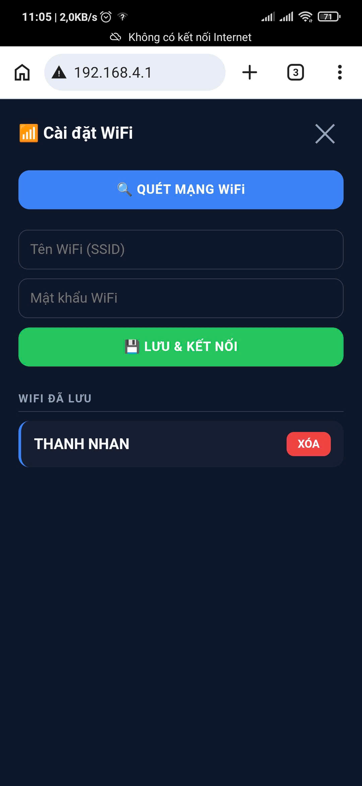
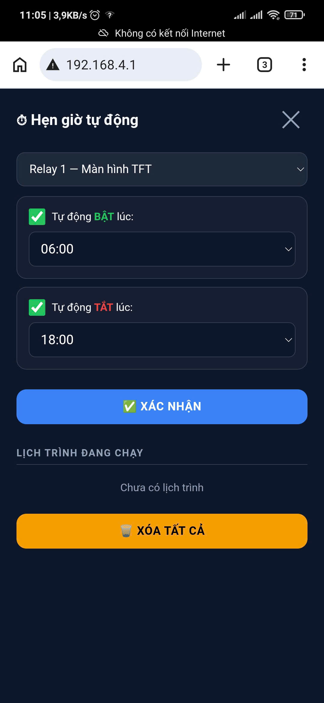
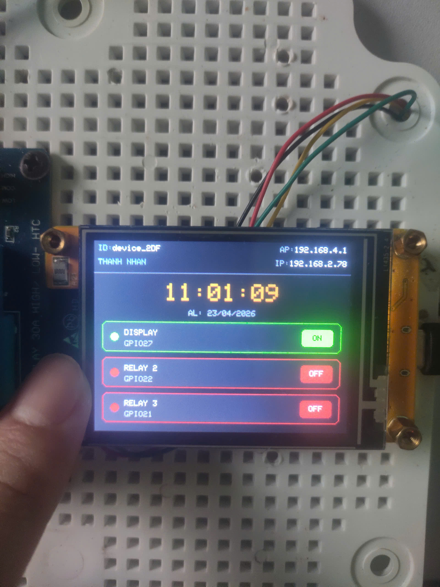

# ESP32 CYD Vession v1.0.1 (Cheap Yellow Display) Configuration 

<p align="center">
  
</p>

Dự án này chứa mã nguồn cấu hình tối ưu hóa cho màn hình **ESP32 CYD (Cheap Yellow Display)** sử dụng thư viện **TFT_eSPI** của Bodmer. File cấu hình `User_Setup.h` đã được tinh chỉnh, dọn dẹp sạch sẽ và sẵn sàng để nạp trực tiếp.

<p align="center">
  <b>📷 ALBUM HÌNH ẢNH DỰ ÁN</b>
</p>
<table align="center">
  <tr>
    <td></td>
    <td></td>
  </tr>
  <tr>
    <td></td>
    <td></td>
  </tr>
</table>

> ⚠️ **LƯU Ý:** Dự án hiện **đang trong quá trình phát triển (Under Development)**. Các tính năng và cấu hình chân có thể thay đổi.

## 🚀 Tính năng & Cấu hình hiện tại
- **Driver màn hình:** `ILI9341_2_DRIVER` (Phiên bản driver tối ưu cho CYD).
- **Độ phân giải:** 240 x 320 pixel.
- **Giao tiếp SPI:** Sử dụng cổng `HSPI` trên ESP32 để tối ưu hóa hiệu năng hiển thị.
- **Tốc độ:** Tần số ghi SPI đạt `55MHz` giúp phản hồi đồ họa cực mượt.
- **Cảm ứng:** Tích hợp bộ điều khiển cảm ứng `XPT2046` trên chân `TOUCH_CS 33` với tần số ổn định `2.5MHz`.
- **Đèn nền (Backlight):** Điều khiển qua chân `GPIO 21` (Mức cao - `HIGH`).
- **Font chữ:** Tích hợp sẵn bộ Font 1, 2, 4, 6, 7, 8 và `SMOOTH_FONT` chống răng cưa.

## 📁 Cấu trúc thư mục khuyến nghị
```text
esp32-cyd/
├── User_Setup.h       # File cấu hình chính cho thư viện TFT_eSPI
├── LICENSE            # Giấy phép mã nguồn mở MIT
├── COPYRIGHT.md       # Tuyên bố bản quyền & Tình trạng phát triển
└── README.md          # Tài liệu hướng dẫn sử dụng này
```

## 🛠️ Hướng dẫn Cài đặt nhanh
1. Cài đặt thư viện **TFT_eSPI** của Bodmer thông qua Arduino IDE Library Manager hoặc PlatformIO.
2. Tìm đến thư mục lưu trữ thư viện `TFT_eSPI` trên máy tính của bạn.
3. Thay thế file `User_Setup.h` mặc định của thư viện bằng file `User_Setup.h` được cung cấp trong kho lưu trữ này.
4. Tiến hành nạp code ví dụ (như các bài viết từ Random Nerd Tutorials) để kiểm tra màn hình và cảm ứng.

## 📝 Giấy phép & Bản quyền
Dự án được phát hành theo giấy phép **MIT License**. Vui lòng xem chi tiết tại file [LICENSE](LICENSE) và [COPYRIGHT.md](COPYRIGHT.md).
